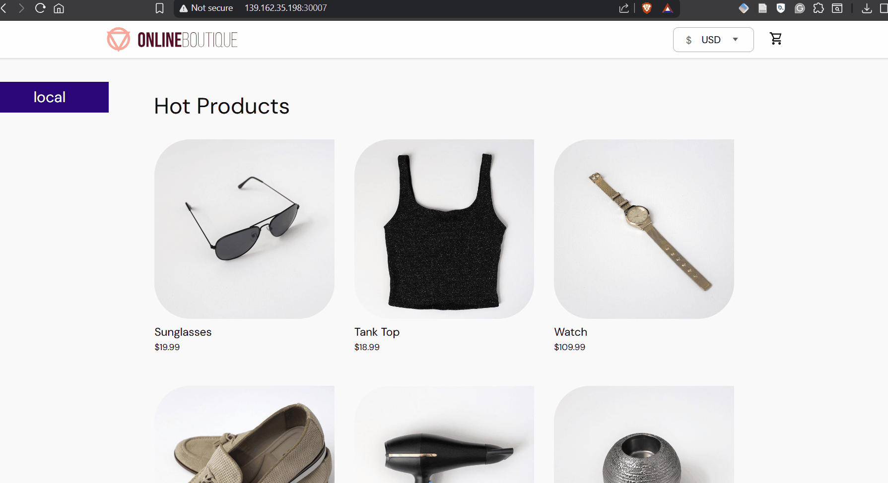
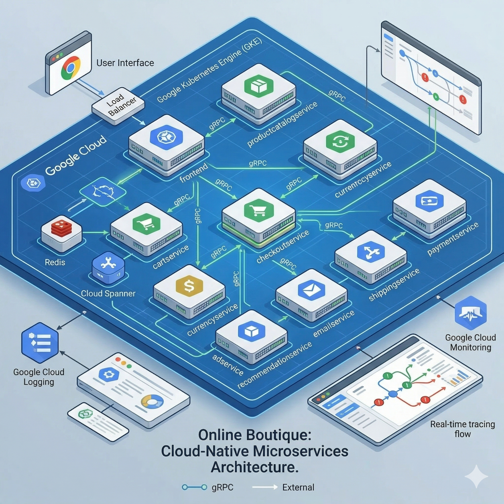

# Microservices Demo - Kubernetes Deployment

A complete microservices architecture deployed on Kubernetes, featuring an online shop with multiple independent services communicating with each other through service discovery.

## Table of Contents

- [Overview](#overview)
- [Architecture](#architecture)
- [Services](#services)
- [Prerequisites](#prerequisites)
- [Deployment](#deployment)
- [Service Access](#service-access)
- [Service Dependencies](#service-dependencies)
- [Troubleshooting](#troubleshooting)




## Overview

This project implements a realistic microservices-based online shop system using Kubernetes. The application is built using Google's microservices demo, with 10+ independent services handling different aspects of the e-commerce platform including product catalog, shopping cart, payment processing, shipping, and frontend UI.

**Key Features:**
- Multiple independent microservices
- Service-to-service communication via DNS
- Persistent data storage (Redis)
- Frontend web interface
- ClusterIP services for internal communication
- NodePort service for external access to frontend

## Architecture



## Services

### 1. **Frontend Service**
- **Purpose:** Web UI for the online shop
- **Container Port:** 8080
- **Service Port:** 80
- **Access:** NodePort 30007
- **Dependencies:** Product Catalog, Currency, Cart, Recommendation, Shipping, Checkout, Ads, Shopping Assistant
- **Image:** `us-central1-docker.pkg.dev/google-samples/microservices-demo/frontend:v0.10.5`

### 2. **Product Catalog Service**
- **Purpose:** Maintains product inventory and catalog
- **Container Port:** 3550
- **Service Port:** 3550
- **Dependencies:** None
- **Image:** `us-central1-docker.pkg.dev/google-samples/microservices-demo/productcatalogservice:v0.10.5`

### 3. **Cart Service**
- **Purpose:** Manages shopping cart for users
- **Container Port:** 7070
- **Service Port:** 7070
- **Storage:** Redis (redis-cart:6379)
- **Dependencies:** Redis
- **Image:** `us-central1-docker.pkg.dev/google-samples/microservices-demo/cartservice:v0.10.5`

### 4. **Redis Cart**
- **Purpose:** In-memory data store for cart persistence
- **Container Port:** 6379
- **Service Port:** 6379
- **Storage:** EmptyDir volume at /data
- **Image:** `redis:alpine`

### 5. **Checkout Service**
- **Purpose:** Handles checkout workflow and order processing
- **Container Port:** 5050
- **Service Port:** 5050
- **Dependencies:** Product Catalog, Shipping, Payment, Email, Currency, Cart
- **Image:** `us-central1-docker.pkg.dev/google-samples/microservices-demo/checkoutservice:v0.10.5`

### 6. **Payment Service**
- **Purpose:** Processes payment transactions
- **Container Port:** 50051
- **Service Port:** 50051
- **Profiler:** Disabled
- **Dependencies:** None
- **Image:** `us-central1-docker.pkg.dev/google-samples/microservices-demo/paymentservice:v0.10.5`

### 7. **Shipping Service**
- **Purpose:** Handles order shipping and logistics
- **Container Port:** 50051
- **Service Port:** 50051
- **Dependencies:** None
- **Image:** `us-central1-docker.pkg.dev/google-samples/microservices-demo/shippingservice:v0.10.5`

### 8. **Currency Service**
- **Purpose:** Manages currency exchange rates
- **Container Port:** 7000
- **Service Port:** 7000
- **Profiler:** Disabled
- **Dependencies:** None
- **Image:** `us-central1-docker.pkg.dev/google-samples/microservices-demo/currencyservice:v0.10.5`

### 9. **Email Service**
- **Purpose:** Sends notifications and emails
- **Container Port:** 8080
- **Service Port:** 5000
- **Dependencies:** None
- **Image:** `us-central1-docker.pkg.dev/google-samples/microservices-demo/emailservice:v0.10.5`

### 10. **Recommendation Service**
- **Purpose:** Provides product recommendations
- **Container Port:** 8080
- **Service Port:** 8080
- **Dependencies:** Product Catalog
- **Image:** `us-central1-docker.pkg.dev/google-samples/microservices-demo/recommendationservice:v0.10.5`

### 11. **Ads Service**
- **Purpose:** Manages advertisement serving
- **Container Port:** 9555
- **Service Port:** 9555
- **Dependencies:** None
- **Image:** `us-central1-docker.pkg.dev/google-samples/microservices-demo/adservice:v0.10.5`

## Prerequisites

- **Kubernetes Cluster:** v1.19 or higher
- **kubectl:** Configured with appropriate cluster credentials
- **Microservices Namespace:** A dedicated namespace for these services (recommended)

## Deployment

### 1. Create a Namespace (Recommended)

```bash
kubectl create namespace microservices
```

### 2. Deploy All Services

```bash
kubectl apply -f config.yaml -n microservices
```

### 3. Verify Deployment

```bash
# Check all deployments
kubectl get deployments -n microservices

# Check all services
kubectl get services -n microservices

# Check pods status
kubectl get pods -n microservices
```

### 4. Wait for All Pods to be Ready

```bash
kubectl wait --for=condition=ready pod -l app --timeout=300s -n microservices
```

## Service Access

### Frontend (Web UI)

Access the online shop frontend using the NodePort:

```bash
# Get the node IP
kubectl get nodes -o wide

# Access frontend at: http://<NODE_IP>:30007
```

Or use port-forwarding if running locally:

```bash
kubectl port-forward -n microservices svc/frontend 8080:80
# Then visit: http://localhost:8080
```

### Internal Service Communication

Services communicate via DNS names within the cluster:

```
<service-name>:<service-port>
```

**Examples:**
- `productcatalogservice:3550`
- `cartservice:7070`
- `redis-cart:6379`
- `shippingservice:50051`

### Cross-Namespace Access

If services are in different namespaces, use fully qualified domain names:

```
<service-name>.<namespace>.svc.cluster.local:<service-port>
```

## Service Dependencies

### Dependency Graph

```
Frontend
├── Product Catalog Service
├── Cart Service
├── Checkout Service
│   ├── Product Catalog Service
│   ├── Shipping Service
│   ├── Payment Service
│   ├── Email Service
│   ├── Currency Service
│   └── Cart Service
├── Currency Service
├── Recommendation Service
│   └── Product Catalog Service
├── Shipping Service
├── Ads Service
└── Shopping Assistant Service (external)

Cart Service
└── Redis Cache

Redis Cart (standalone)
```

## Troubleshooting

### Check Service Status

```bash
# View all resources in the namespace
kubectl get all -n microservices

# Describe a specific service
kubectl describe svc <service-name> -n microservices

# Describe a specific deployment
kubectl describe deployment <deployment-name> -n microservices
```

### View Logs

```bash
# View logs from a specific pod
kubectl logs -n microservices <pod-name>

# View logs with streaming (follow)
kubectl logs -f -n microservices <pod-name>

# View logs from a specific container in a deployment
kubectl logs -n microservices deployment/<deployment-name>
```

### Network Connectivity

```bash
# Test DNS resolution from a pod
kubectl run -it --rm debug --image=busybox --restart=Never -- nslookup productcatalogservice.microservices

# Test service accessibility
kubectl run -it --rm debug --image=curlimages/curl --restart=Never -- curl http://frontend.microservices:80
```

### Common Issues

**Services can't communicate:**
- Verify all pods are running: `kubectl get pods -n microservices`
- Check logs for connection errors: `kubectl logs -n microservices <pod-name>`
- Ensure service names match environment variable configurations

**Pod stuck in pending:**
- Check node resources: `kubectl top nodes`
- Check for resource constraints: `kubectl describe pod <pod-name> -n microservices`

**Redis connection issues:**
- Verify redis-cart pod is running: `kubectl get pod -n microservices -l app=redis-cart`
- Check redis-cart service: `kubectl get svc redis-cart -n microservices`

## Configuration Files

- `config.yaml` - Complete Kubernetes manifest with all deployments and services

## Additional Commands

### Scale a Service

```bash
kubectl scale deployment <deployment-name> --replicas=3 -n microservices
```

### Update Image Version

```bash
kubectl set image deployment/<deployment-name> <container-name>=<new-image>:<tag> -n microservices
```

### Delete All Resources

```bash
kubectl delete -f config.yaml -n microservices
```

### Monitor in Real-time

```bash
kubectl get pods -n microservices -w
```

## Notes

- All services use ClusterIP type for internal communication, except Frontend which uses NodePort for external access
- Redis uses an emptyDir volume, so data is lost on pod restart
- Services communicate via DNS service discovery within the cluster
- For cross-namespace communication, use fully qualified domain names
- The profiler is disabled on Payment and Currency services for performance

---

**Version:** 1.0  
**Last Updated:** 2026-04-21  
**Based on:** Google Microservices Demo
